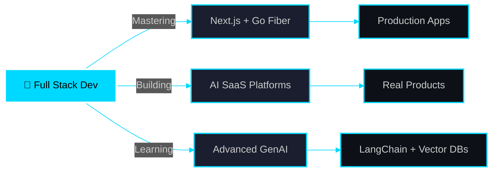

<div align="center">

<!-- Animated Wave Header -->


<!-- Typing SVG -->
<a href="https://git.io/typing-svg">
  
</a>

<br/><br/>

[](https://sa-portfolio-psi.vercel.app/)
[](https://linkedin.com/in/ahill-selvaraj)
[](https://github.com/AHILL-0121)
[](mailto:sa.education5211@gmail.com)


</div>

---

<div align="center">

```
     ╔═══════════════════════════════════════════════════════╗
     ║   💻 CODE  •  🤖 AI  •  🔐 SECURITY  •  📊 DATA     ║
     ╚═══════════════════════════════════════════════════════╝
```

</div>

---


## 🎯 WHO AM I?


```typescript
const Ahill = {
    role: "Full Stack Architect",
    location: "Coimbatore, Tamil Nadu 🇮🇳",
    mission: "Building Tomorrow's Tech Today",
    
    currentFocus: [
        "🤖 GenAI Integration & LLM Applications",
        "⚡ High-Performance Web Systems",
        "🔒 Advanced Security Implementations",
        "📈 Real-Time Data Platforms"
    ],
    
    philosophy: "Clean Code. Bold Ideas. Zero Limits.",
    
    lifeGoals: {
        shortTerm: "Master AI-Driven Development",
        longTerm: "Revolutionize Digital Experiences"
    }
};
```

<br clear="right"/>

---


<br clear="right"/>

---

<div align="center">

## ⚡ ARSENAL OF TECHNOLOGIES ⚡

<table>
<tr>
<td valign="top" width="33%">

### 🎨 Frontend
<div align="center">


</div>
</td>
<td valign="top" width="33%">

### ⚙️ Backend
<div align="center">


</div>
</td>
<td valign="top" width="33%">

### 🗄️ Data & Cloud
<div align="center">


</div>
</td>
</tr>
</table>

### 🤖 AI / ML POWERHOUSE


</div>

---

<div align="center">

## 🚀 NOTABALE PROJECTS

<table>
<tr>
<td width="50%">

### ⚖️ GitVerdict
**Next.js · GitHub API · AI Analysis**

🔍 AI-powered GitHub repo analyser  
📊 Instant code quality verdict  
🧠 Smart repo insight generation  
🚀 Zero-config, paste & judge  

[](https://github.com/AHILL-0121/gitverdict)
[](https://sa-git-verdict.vercel.app/)

</td>
<td width="50%">

### 🌳 Fam Tree Builder
**Next.js · React · Data Visualization**

👨‍👩‍👧‍👦 Interactive family tree builder  
🌿 Dynamic node-based relationships  
💾 Save & share your lineage  
🎨 Clean, intuitive UI  

[](https://github.com/AHILL-0121/fam-tree)
[](https://sa-fam-tree-builder.vercel.app/)

</td>
</tr>
<tr>
<td width="50%">

### 💣 Word Bomb
**Next.js · WebSocket · Real-Time**

💥 Multiplayer word-bombing game  
⚡ Real-time WebSocket gameplay  
🏆 Live score & leaderboard  
📱 Mobile-ready fast-paced fun  

[](https://github.com/AHILL-0121/wordbomb)
[](https://sa-word-bomb.vercel.app/)

</td>
<td width="50%">

### 🔎 DevLens
**Next.js · GitHub API · Dev Insights**

🧑‍💻 Deep GitHub profile analyser  
📈 Contribution & language breakdown  
🔬 Repo-level code insights  
⚡ Instant developer fingerprint  

[](https://github.com/AHILL-0121/devlens)
[](https://sa-dev-lens.vercel.app/)

</td>
</tr>
<tr>
<td width="50%">

### 🧩 LeetCode API
**Go Fiber · REST API · Web Scraping**

📡 Unofficial LeetCode stats API  
🏅 Fetch any user's solved problems  
⚡ Blazing-fast Go Fiber backend  
🔓 Open & free to use  

[](https://github.com/AHILL-0121/leet-api)
[](https://leetapi.vercel.app/)

</td>
<td width="50%">

### 🏋️ Exercism API
**Go Fiber · REST API · Learning**

📚 Exercism track & exercise fetcher  
🔗 Clean REST endpoints  
⚡ Go-powered ultra-fast responses  
🛠️ Dev tool for learning platforms  

[](https://github.com/AHILL-0121/exercism-api)
[](https://sa-exercismapi.vercel.app/)

</td>
</tr>
<tr>
<td width="50%">

### 🧾 ProcureAI
**Next.js · FastAPI · Multi-Agent AI**

🤖 Multi-agent invoice automation  
🔍 Three-way PO match engine  
⚡ ~250ms dashboard via query optimization  
📧 IMAP email intake & OCR extraction  

[](https://github.com/AHILL-0121/ProcureAI)
[](https://sa-procure-ai.vercel.app/)

</td>
<td width="50%">

### 🎮 CategoryCrash
**Next.js · PartyKit · Groq AI**

💥 Real-time multiplayer word game  
🧠 AI-validated dual-category answers  
⚡ Sub-200ms Groq llama-3.3-70b judgement  
🏆 Speed & creativity scoring system  

[](https://github.com/AHILL-0121/CategoryCrash)
[](https://sa-category-crash.vercel.app/)

</td>
</tr>
<tr>
<td width="50%">

### 🌤️ Weather Dashboard
**Next.js · Weather API · Real-Time**

🌍 Real-time global weather intelligence  
🔍 Instant city search & lookup  
📡 Live data with clean visual display  
⚡ Fast, minimal, distraction-free  

[](https://github.com/AHILL-0121/WEATHER-DASHBOARD)
[](https://sa-weather-dashboard.vercel.app/)

</td>
<td width="50%">

### 📰 The Silicon Gazette
**Next.js · Groq · Tavily Search**

🗞️ AI-powered daily tech newspaper  
🕰️ Vintage broadsheet design system  
🔍 Live web search + LLM synthesis  
📅 One cached edition generated per day  

[](https://github.com/AHILL-0121/The-Silicon-Gazette)
[](https://sa-silicon-gazette.vercel.app/)

</td>
</tr>
</table>

</div>
---

<div align="center">

## 📊 BATTLE STATISTICS


</div>

---

<div align="center">

## 🏆 ACHIEVEMENTS & TROPHIES


</div>

---

<div align="center">

## 🎯 CURRENT MISSIONS


```mermaid
%%{init: {'theme':'dark', 'themeVariables': { 'primaryColor':'#00D9FF','primaryTextColor':'#fff','primaryBorderColor':'#00D9FF','lineColor':'#00D9FF','secondaryColor':'#0D1117','tertiaryColor':'#1a1e2e'}}}%%
graph LR
    A[🚀 Full Stack Dev] -->|Mastering| B[Next.js + Go Fiber]
    A -->|Building| C[AI SaaS Platforms]
    A -->|Learning| D[Advanced GenAI]
    B --> E[Production Apps]
    C --> F[Real Products]
    D --> G[LangChain + Vector DBs]
    
    style A fill:#00D9FF,stroke:#fff,stroke-width:3px,color:#000
    style B fill:#1a1e2e,stroke:#00D9FF,stroke-width:2px
    style C fill:#1a1e2e,stroke:#00D9FF,stroke-width:2px
    style D fill:#1a1e2e,stroke:#00D9FF,stroke-width:2px
    style E fill:#0D1117,stroke:#00D9FF,stroke-width:2px
    style F fill:#0D1117,stroke:#00D9FF,stroke-width:2px
    style G fill:#0D1117,stroke:#00D9FF,stroke-width:2px
```

</div>

<div align="center">

## 🎓 LEARNING JOURNEY

<table>
<tr>
<td valign="top">

### ✅ Conquered
- Next.js Advanced Patterns
- Go Fiber REST APIs
- MySQL Database Design
- JWT & OAuth Security
- WebSocket Real-Time Apps
- GenAI API Integration
- Cybersecurity (NIDS, OWASP)

</td>
<td valign="top">

### 🔄 In Progress
- LangChain Framework
- Vector Databases (Pinecone)
- Advanced ML Pipelines
- Kubernetes & DevOps
- React Native Development

</td>
<td valign="top">

### 🔮 Future Goals
- Building Autonomous AI Agents
- Microservices Architecture
- Data Science Dashboards
- AWS Architect Certification
- Mobile-First AI SaaS Product

</td>
</tr>
</table>

</div>

---

<div align="center">

## 🐍 CONTRIBUTION SNAKE

<picture>
  <source media="(prefers-color-scheme: dark)" srcset="https://raw.githubusercontent.com/AHILL-0121/AHILL-0121/main/github-contribution-grid-snake-dark.svg">
  <source media="(prefers-color-scheme: light)" srcset="https://raw.githubusercontent.com/AHILL-0121/AHILL-0121/main/github-contribution-grid-snake.svg">
  
</picture>

</div>

---

<div align="center">

## 🦜 OTHER LEARNING

[](https://www.duolingo.com/profile/the1anonymous.)

[](https://leetcode.com/u/ahillselvaraaj/)


[](https://exercism.org/profiles/AHILL-0121)
</div>

---

<div align="center">

## 💭 DEVELOPER WISDOM


</div>

---

<div align="center">

## 🌐 LET'S BUILD SOMETHING LEGENDARY

<a href="https://linkedin.com/in/ahill-selvaraj"></a>
<a href="https://github.com/AHILL-0121"></a>
<a href="https://sa-portfolio-psi.vercel.app/"></a>
<a href="mailto:ahillselvaraj@gmail.com"></a>


###  POWERED BY PASSION · DRIVEN BY CODE · FUELED BY INNOVATION 

<!-- Animated Wave Footer -->


</div>
