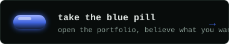
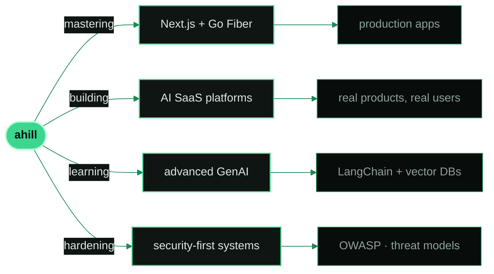
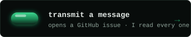

<!--
  Matrix profile. Palette matches sa-portfolio-psi.vercel.app:
  bg #080C0B · line #1E2925 · green #3DD68F · dim #1C8A57 · text #E0E6E3
  SVGs in /assets are built by .github/scripts/build_assets.py (static) and build_stats.py (daily Action).
  Every animation respects prefers-reduced-motion.
-->

<<<<<<< HEAD
<!-- Animated Wave Header -->

=======
<a href="https://sa-portfolio-psi.vercel.app/"></a>
>>>>>>> 43e8de7 (Redesign profile README with Matrix theme: animated SVG header, project cards, stack and telemetry panels, plus daily stats workflow)

<p align="center">
  <a href="https://sa-portfolio-psi.vercel.app/"></a>
  <a href="https://linkedin.com/in/ahill-selvaraj"></a>
  <a href="mailto:sa.education5211@gmail.com"></a>
  <a href="https://leetcode.com/u/ahillselvaraaj/"></a>
  
</p>

<p align="center">
  <a href="#03--ls-projects"></a>
  <a href="https://sa-portfolio-psi.vercel.app/"></a>
</p>

<p align="center">
  <a href="#01--whoami"><code>./whoami</code></a>&nbsp;
  <a href="#02--git-log"><code>git log</code></a>&nbsp;
  <a href="#03--ls-projects"><code>ls ~/projects</code></a>&nbsp;
  <a href="#04--stack"><code>tree ~/stack</code></a>&nbsp;
  <a href="#05--telemetry"><code>./telemetry</code></a>&nbsp;
  <a href="#06--missions"><code>cat missions</code></a>&nbsp;
  <a href="#07--transmit"><code>./transmit</code></a>
</p>

I build AI products and the full-stack systems around them. My first two internships were in cybersecurity, so I learned how systems get broken before I started shipping my own.
Twelve projects below, each with a live URL. Pick one and try it.

<br/>

## `01` / whoami


```yaml
name:      Ahill Selvaraj
based:     Coimbatore, Tamil Nadu, IN
study:     B.Tech Information Technology    # SNS College of Technology
           + Honours, AI & Data Science     # CGPA 8.94
certs:     10+ · AWS Academy, Cisco, IBM SkillsBuild, NPTEL
focus:
  - multi-agent systems & LLM products
  - fast web systems (Next.js + Go Fiber)
  - real-time apps (WebSocket, SSE, PartyKit)
  - security-first engineering
motto:     "Clean code. Bold ideas. Zero limits."
status:    open to opportunities
```

<br clear="right"/>

<details>
<summary><b>locate operator</b> &nbsp;<sub>(interactive map)</sub></summary>

```geojson
{
  "type": "FeatureCollection",
  "features": [
    {
      "type": "Feature",
      "properties": { "name": "Ahill Selvaraj", "description": "Coimbatore, Tamil Nadu. Building from here.", "marker-color": "#3DD68F", "marker-symbol": "star" },
      "geometry": { "type": "Point", "coordinates": [76.9558, 11.0168] }
    }
  ]
}
```

</details>

## `02` / git log

```console
$ git log --oneline --author=ahill
e7c21a0 (HEAD -> main)  now   ship: 12 projects live, every one with a public URL
4b9f03d                 2025  feat: data science intern @ NXTLOGIC Software Solutions
91ad6e2                 2024  feat: cybersecurity intern @ Ether Infotech
c03f7b8                 2023  feat: cybersecurity & ethical hacking intern @ Virtual Coincent
0000001                 2022  init: B.Tech IT, SNS College of Technology
```

## `03` / ls ~/projects

<sub>click a card for the source · the <code>●</code> host on each card is its live deploy</sub>

<details open>
<summary><b><code>./ai-systems</code></b> &nbsp;<sub>4 · agents, LLMs, ML pipelines</sub></summary>
<br/>
<p align="center">
  <a href="https://github.com/AHILL-0121/ProcureAI"></a>
  <a href="https://github.com/AHILL-0121/DataPulse"></a>
  <a href="https://github.com/AHILL-0121/The-Silicon-Gazette"></a>
  <a href="https://github.com/AHILL-0121/gitverdict"></a>
</p>
<p align="center"><sub>run live →
  <a href="https://sa-procure-ai.vercel.app/">procureai</a> ·
  <a href="https://sa-datapulse.vercel.app/">datapulse</a> ·
  <a href="https://sa-silicon-gazette.vercel.app/">silicon-gazette</a> ·
  <a href="https://sa-git-verdict.vercel.app/">gitverdict</a>
</sub></p>
</details>

<details open>
<summary><b><code>./products</code></b> &nbsp;<sub>5 · SaaS, multiplayer, real-time</sub></summary>
<br/>
<p align="center">
  <a href="https://github.com/AHILL-0121/KIPD"></a>
  <a href="https://github.com/AHILL-0121/CategoryCrash"></a>
  <a href="https://github.com/AHILL-0121/wordbomb"></a>
  <a href="https://github.com/AHILL-0121/fam-tree"></a>
  <a href="https://github.com/AHILL-0121/WEATHER-DASHBOARD"></a>
</p>
<p align="center"><sub>run live →
  <a href="https://sa-kipd.vercel.app/">kipd</a> ·
  <a href="https://sa-category-crash.vercel.app/">categorycrash</a> ·
  <a href="https://sa-word-bomb.vercel.app/">wordbomb</a> ·
  <a href="https://sa-fam-tree-builder.vercel.app/">fam-tree</a> ·
  <a href="https://sa-weather-dashboard.vercel.app/">weather</a>
</sub></p>
</details>

<details open>
<summary><b><code>./dev-tools</code></b> &nbsp;<sub>3 · APIs and analysers other devs can use</sub></summary>
<br/>
<p align="center">
  <a href="https://github.com/AHILL-0121/devlens"></a>
  <a href="https://github.com/AHILL-0121/leet-api"></a>
  <a href="https://github.com/AHILL-0121/exercism-api"></a>
</p>
<p align="center"><sub>run live →
  <a href="https://sa-dev-lens.vercel.app/">devlens</a> ·
  <a href="https://leetapi.vercel.app/">leet-api</a> ·
  <a href="https://sa-exercismapi.vercel.app/">exercism-api</a>
</sub></p>
</details>

## `04` / stack



## `05` / telemetry




<picture>
  <source media="(prefers-color-scheme: dark)" srcset="./github-contribution-grid-snake-matrix.svg">
  
</picture>

<details>
<summary><b>trophies · leetcode · duolingo</b> &nbsp;<sub>(expand)</sub></summary>
<br/>



<a href="https://leetcode.com/u/ahillselvaraaj/"></a>

<p align="center"><a href="https://www.duolingo.com/profile/the1anonymous."></a></p>

<sub>the LeetCode heatmap is rendered by an API I wrote (see <code>./dev-tools</code>) · also on <a href="https://exercism.org/profiles/AHILL-0121">exercism</a></sub>
</details>

## `06` / missions


```mermaid
%%{init: {'theme':'base','themeVariables':{'background':'#080C0B','primaryColor':'#080C0B','primaryTextColor':'#E0E6E3','primaryBorderColor':'#3DD68F','lineColor':'#1C8A57','secondaryColor':'#0E1512','tertiaryColor':'#0E1512','fontFamily':'monospace'}}}%%
graph LR
    A(["ahill"]) -->|mastering| B["Next.js + Go Fiber"]
    A -->|building| C["AI SaaS platforms"]
    A -->|learning| D["advanced GenAI"]
    A -->|hardening| S["security-first systems"]
    B --> E["production apps"]
    C --> F["real products, real users"]
    D --> G["LangChain + vector DBs"]
    S --> H["OWASP · threat models"]

    classDef core fill:#3DD68F,stroke:#B6FFD9,stroke-width:2px,color:#080C0B,font-weight:bold
    classDef mid fill:#0E1512,stroke:#3DD68F,stroke-width:1.5px,color:#E0E6E3
    classDef out fill:#080C0B,stroke:#1C8A57,stroke-width:1px,color:#8FA39A
    class A core
    class B,C,D,S mid
    class E,F,G,H out
```

<table>
<tr>
<td valign="top" width="33%">

**`[done]`**
```diff
+ Next.js advanced patterns
+ Go Fiber REST APIs
+ MySQL schema design
+ JWT & OAuth
+ WebSocket real-time apps
+ GenAI API integration
+ NIDS, OWASP
```

</td>
<td valign="top" width="33%">

**`[running]`**
```diff
! LangChain
! vector DBs (Pinecone)
! ML pipelines
! Kubernetes & DevOps
! React Native
```

</td>
<td valign="top" width="33%">

**`[queued]`**
```diff
# autonomous AI agents
# microservices
# data science dashboards
# AWS Solutions Architect
# mobile-first AI SaaS
```

</td>
</tr>
</table>

## `07` / transmit

<p align="center">
  <a href="https://github.com/AHILL-0121/AHILL-0121/issues/new?title=signal%3A+hello+from+%5Byour+name%5D&body=Where+did+you+find+me%3F%0A%0AWhat+are+you+building%3F%0A&labels=signal"></a>
</p>

<p align="center">
  <a href="https://linkedin.com/in/ahill-selvaraj"><code>linkedin</code></a> ·
  <a href="mailto:sa.education5211@gmail.com"><code>mail</code></a> ·
  <a href="https://sa-portfolio-psi.vercel.app/"><code>portfolio</code></a> ·
  <a href="https://github.com/AHILL-0121?tab=repositories"><code>all repos</code></a>
</p>



<a href="https://sa-portfolio-psi.vercel.app/"></a>
