<!--
  AHILL S · profile README
  Every panel is an SVG in /assets, drawn at GitHub's 840px column so type renders 1:1.
  Static panels: python .github/scripts/build_assets.py
  Live panels (signal-*.svg): python .github/scripts/build_stats.py  (runs daily in Actions)
-->

<a href="https://sa-portfolio-psi.vercel.app/"></a>

<p><a href="#about">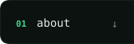</a><a href="#work">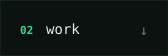</a><a href="#stack"></a><a href="#signal">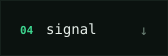</a><a href="#contact">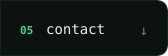</a></p>

<a name="about"></a>


<p>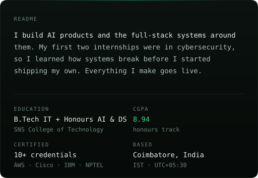 </p>

<details>
<summary><sub>&nbsp;<code>where</code>&nbsp; open the map</sub></summary>

```geojson
{
  "type": "FeatureCollection",
  "features": [
    {
      "type": "Feature",
      "properties": { "name": "AHILL S", "description": "Coimbatore, Tamil Nadu. Building from here.", "marker-color": "#3DD68F", "marker-symbol": "star" },
      "geometry": { "type": "Point", "coordinates": [76.9558, 11.0168] }
    }
  ]
}
```

</details>

<a name="work"></a>


<p><a href="https://sa-procure-ai.vercel.app/"></a> <a href="https://sa-kipd.vercel.app/"></a>
<a href="https://sa-datapulse.vercel.app/"></a> <a href="https://sa-category-crash.vercel.app/"></a></p>

<p><a href="https://sa-silicon-gazette.vercel.app/">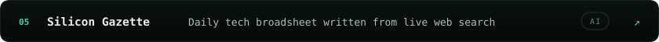</a>
<a href="https://sa-git-verdict.vercel.app/">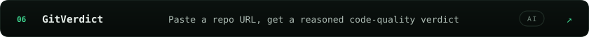</a>
<a href="https://sa-dev-lens.vercel.app/">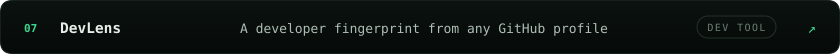</a>
<a href="https://leetapi.vercel.app/">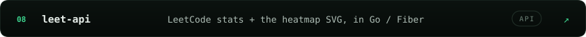</a>
<a href="https://sa-exercismapi.vercel.app/">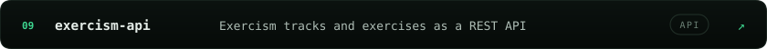</a>
<a href="https://sa-word-bomb.vercel.app/">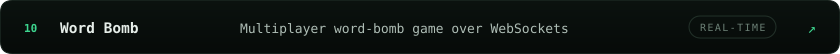</a>
<a href="https://sa-fam-tree-builder.vercel.app/">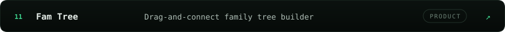</a>
<a href="https://sa-weather-dashboard.vercel.app/">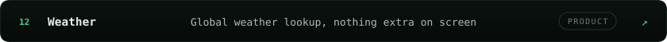</a></p>

<details>
<summary><sub>&nbsp;<code>src</code>&nbsp; source code for every project</sub></summary>
<br/>

[procureai](https://github.com/AHILL-0121/ProcureAI) · [kipd](https://github.com/AHILL-0121/KIPD) · [datapulse](https://github.com/AHILL-0121/DataPulse) · [categorycrash](https://github.com/AHILL-0121/CategoryCrash) · [silicon-gazette](https://github.com/AHILL-0121/The-Silicon-Gazette) · [gitverdict](https://github.com/AHILL-0121/gitverdict) · [devlens](https://github.com/AHILL-0121/devlens) · [leet-api](https://github.com/AHILL-0121/leet-api) · [exercism-api](https://github.com/AHILL-0121/exercism-api) · [wordbomb](https://github.com/AHILL-0121/wordbomb) · [fam-tree](https://github.com/AHILL-0121/fam-tree) · [weather-dashboard](https://github.com/AHILL-0121/WEATHER-DASHBOARD)

</details>

<a name="stack"></a>



<a name="signal"></a>




<p> </p>

<details>
<summary><sub>&nbsp;<code>more</code>&nbsp; trophies · leetcode · duolingo · snake</sub></summary>
<br/>


<a href="https://leetcode.com/u/ahillselvaraaj/"></a>

<a href="https://www.duolingo.com/profile/the1anonymous."></a>


</details>

<a name="roadmap"></a>




<details>
<summary><sub>&nbsp;<code>graph</code>&nbsp; interactive mission map</sub></summary>
<br/>

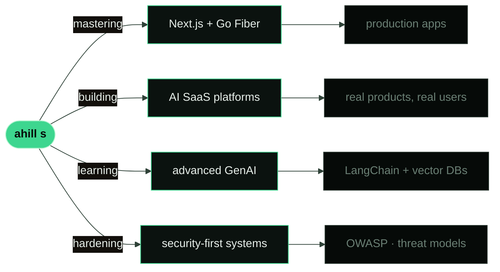
```mermaid
%%{init: {'theme':'base','themeVariables':{'background':'#060A08','primaryColor':'#0B120F','primaryTextColor':'#E6EEE9','primaryBorderColor':'#3DD68F','lineColor':'#2F4238','fontFamily':'monospace'}}}%%
graph LR
    A(["ahill s"]) -->|mastering| B["Next.js + Go Fiber"]
    A -->|building| C["AI SaaS platforms"]
    A -->|learning| D["advanced GenAI"]
    A -->|hardening| S["security-first systems"]
    B --> E["production apps"]
    C --> F["real products, real users"]
    D --> G["LangChain + vector DBs"]
    S --> H["OWASP · threat models"]
    classDef core fill:#3DD68F,stroke:#B6F5D2,color:#060A08,font-weight:bold
    classDef mid fill:#0B120F,stroke:#3DD68F,color:#E6EEE9
    classDef out fill:#060A08,stroke:#223129,color:#6B8075
    class A core
    class B,C,D,S mid
    class E,F,G,H out
```

</details>

<a name="contact"></a>


<p><a href="mailto:sa.education5211@gmail.com">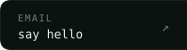</a><a href="https://linkedin.com/in/ahill-selvaraj">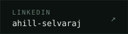</a><a href="https://sa-portfolio-psi.vercel.app/">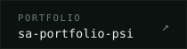</a><a href="https://github.com/AHILL-0121/AHILL-0121/issues/new?title=signal%3A+hello+from+%5Byour+name%5D&body=Where+did+you+find+me%3F%0A%0AWhat+are+you+building%3F%0A">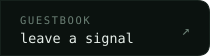</a></p>



<p align="center"></p>
