<div align="center">

<!-- Animated Header with Gradient Text -->


<!-- Typing SVG -->
<a href="https://git.io/typing-svg"></a>

</div>

---

<div align="center">

### 🌊 SURFING THE WAVE OF INNOVATION 🌊

```ascii
     ╔═══════════════════════════════════════════════════════╗
     ║  💻 CODE • 🤖 AI • 🔐 SECURITY • 📊 DATA SCIENCE  ║
     ╚═══════════════════════════════════════════════════════╝
```

</div>


## 🎯 WHO AM I?

```typescript
const Ahill = {
    role: "Full Stack Architect",
    location: "Madurai, Tamil Nadu 🇮🇳",
    mission: "Building Tomorrow's Tech Today",
    
    currentFocus: [
        "🤖 GenAI Integration & LLM Applications",
        "⚡ High-Performance Web Systems",
        "🔒 Advanced Security Implementations",
        "📈 Real-Time Data Platforms"
    ],
    
    philosophy: "Clean Code. Bold Ideas. Zero Limits.",
    
    lifeGoals: {
        shortTerm: "Master AI-Driven Development",
        longTerm: "Revolutionize Digital Experiences"
    }
};
```

<br clear="right"/>

---

<div align="center">

## ⚡ ARSENAL OF TECHNOLOGIES ⚡

<table>
<tr>
<td valign="top" width="33%">

### 🎨 Frontend Mastery
<div align="center">  


</div>

</td>
<td valign="top" width="33%">

### ⚙️ Backend Power
<div align="center">  


</div>

</td>
<td valign="top" width="33%">

### 🗄️ Data & Cloud
<div align="center">  


</div>

</td>
</tr>
</table>

### 🤖 AI/ML POWERHOUSE


</div>

---

<div align="center">

## 🚀 LEGENDARY PROJECTS

<table>
<tr>
<td width="50%">

### 🎨 Personal Portfolio
**Next.js • Framer Motion • Tailwind**

✨ Fully responsive masterpiece  
🎭 Stunning animations  
⚡ Lightning-fast performance  

[](https://github.com/AHILL-0121/portfolio-next)
[](https://sa-portfolio-psi.vercel.app/)

</td>
<td width="50%">

### 📝 AI Content Generator
**Next.js • Go Fiber • OpenAI API**

🤖 GPT-powered blog writer  
✍️ Multiple content types  
🎯 SEO-optimized outputs  

[](https://github.com/AHILL-0121/ai-content-writer)

</td>
</tr>
<tr>
<td width="50%">

### 🛒 E-Commerce Platform
**Next.js • Go Fiber • Stripe • MySQL**

💳 Secure payment integration  
📦 Complete order management  
🔐 JWT authentication  

[](https://github.com/AHILL-0121/ecommerce-next-go)

</td>
<td width="50%">

### 💬 Real-Time Chat
**Next.js • Go • Redis • WebSocket**

⚡ Instant messaging  
🔴 Live status indicators  
📱 Mobile responsive  

[](https://github.com/AHILL-0121/chat-app-go-next)

</td>
</tr>
</table>

</div>

---

<div align="center">

## 📊 BATTLE STATISTICS


</div>

---

<div align="center">

## 🎯 CURRENT MISSIONS

```mermaid
%%{init: {'theme':'dark', 'themeVariables': { 'primaryColor':'#00D9FF','primaryTextColor':'#fff','primaryBorderColor':'#00D9FF','lineColor':'#00D9FF','secondaryColor':'#0D1117','tertiaryColor':'#1a1e2e'}}}%%
graph LR
    A[🚀 Full Stack Dev] -->|Mastering| B[Next.js + Go Fiber]
    A -->|Building| C[AI SaaS Platforms]
    A -->|Learning| D[Advanced GenAI]
    B --> E[Production Apps]
    C --> F[Real Products]
    D --> G[LangChain + Vector DBs]
    
    style A fill:#00D9FF,stroke:#fff,stroke-width:3px,color:#000
    style B fill:#1a1e2e,stroke:#00D9FF,stroke-width:2px
    style C fill:#1a1e2e,stroke:#00D9FF,stroke-width:2px
    style D fill:#1a1e2e,stroke:#00D9FF,stroke-width:2px
    style E fill:#0D1117,stroke:#00D9FF,stroke-width:2px
    style F fill:#0D1117,stroke:#00D9FF,stroke-width:2px
    style G fill:#0D1117,stroke:#00D9FF,stroke-width:2px
```



</div>

---

<div align="center">

## 🏆 ACHIEVEMENTS & TROPHIES

[](https://github.com/ryo-ma/github-profile-trophy)

</div>

---

<div align="center">

## 🎓 LEARNING JOURNEY

<table>
<tr><td>

### ✅ Conquered
- Next.js Advanced Patterns
- Go Fiber REST APIs
- MySQL Database Design
- JWT & OAuth Security
- WebSocket Real-Time Apps
- GenAI API Integration

</td><td>

### 🎯 In Progress
- LangChain Framework
- Vector Databases (Pinecone)
- Advanced ML Pipelines
- Kubernetes & DevOps
- React Native Development

</td><td>

### 🔮 Future Goals
- Building AI Agents
- Microservices Architecture
- Data Science Dashboards
- Blockchain Integration
- Mobile-First AI Apps

</td></tr>
</table>

</div>

---

<div align="center">

## 🌐 CONNECT WITH ME

<a href="https://linkedin.com/in/ahill-selvaraj"></a>
<a href="https://github.com/AHILL-0121"></a>
<a href="https://sa-portfolio-psi.vercel.app/"></a>
<a href="mailto:ahillselvaraj@gmail.com"></a>

### 💬 Let's Build Something Amazing Together!

</div>

---

<div align="center">

### 💭 DEVELOPER WISDOM


</div>

---

<div align="center">

### 👀 PROFILE VIEWS


</div>

---

<div align="center">

## 🐍 CONTRIBUTION SNAKE

<picture>
  <source media="(prefers-color-scheme: dark)" srcset="https://raw.githubusercontent.com/AHILL-0121/AHILL-0121/output/github-contribution-grid-snake-dark.svg">
  <source media="(prefers-color-scheme: light)" srcset="https://raw.githubusercontent.com/AHILL-0121/AHILL-0121/output/github-contribution-grid-snake.svg">
  
</picture>

</div>

---

<div align="center">

### ⚡ POWERED BY PASSION • DRIVEN BY CODE • FUELED BY INNOVATION ⚡

```
╔═══════════════════════════════════════════════════════════════╗
║  "The best way to predict the future is to build it."        ║
║                                    - Ahill Selvaraj           ║
╚═══════════════════════════════════════════════════════════════╝
```


</div>
